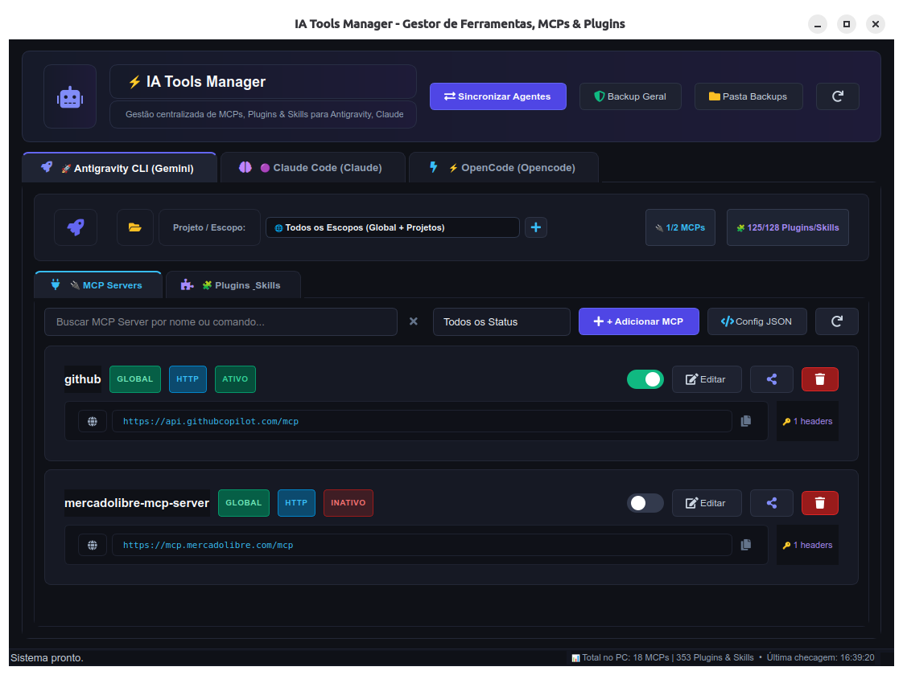
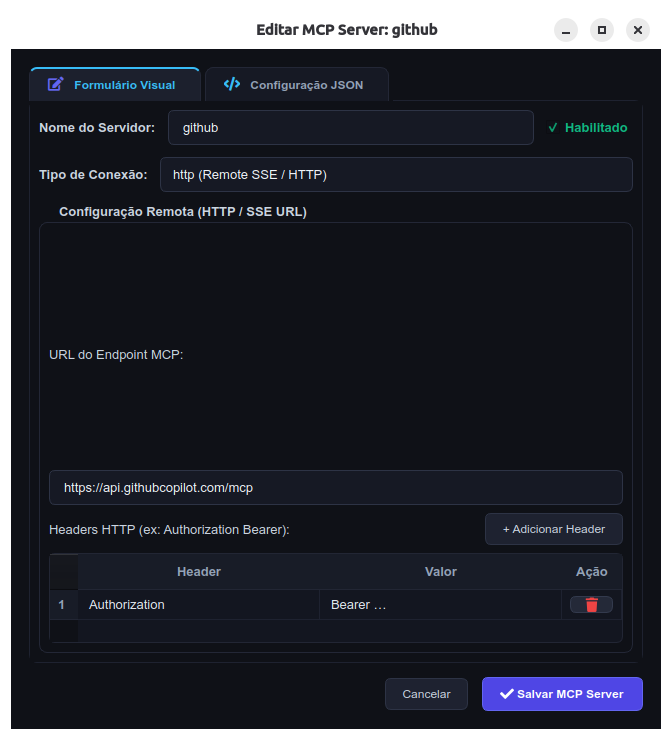
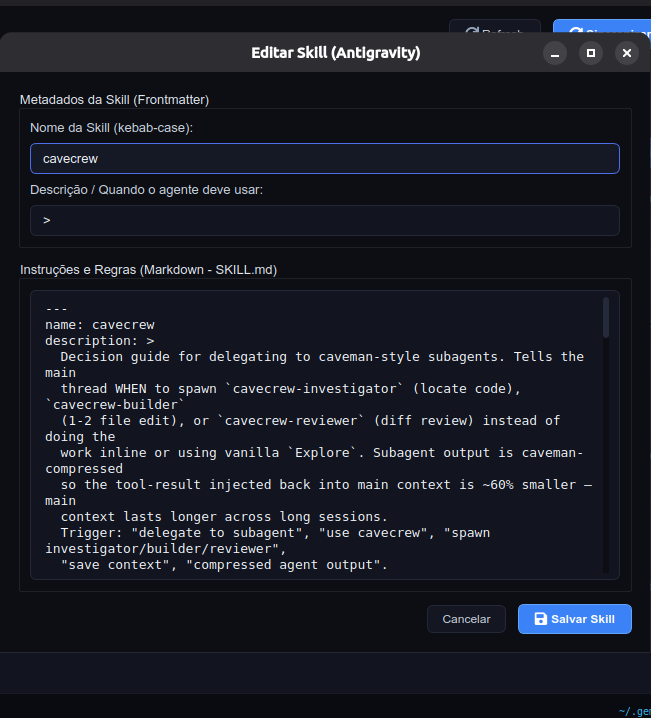

# ⚡ IA Tools Manager

> **Gerenciador visual (GUI) em Python para administração centralizada de MCPs (Model Context Protocol), Plugins e Skills dos seus agentes de IA locais.**

Compatível nativamente com:
- 🚀 **Antigravity CLI** (`agy` / `gemini`)
- 🟣 **Claude Code** (`claude`) — *com suporte a escopos Globais, por Projeto e integrações Cloud Claude.ai*
- ⚡ **OpenCode** (`opencode`)
- 🟧 **Codex** (`codex` / `.agents`)
- 🌊 **Windsurf** (`windsurf` / `codeium`)
- 🖱️ **Cursor** (`cursor`)

---

## 📸 Screenshots da Interface

<div align="center">
  
</div>

<br/>

| 🔌 Editor Visual & JSON de MCP Servers | 🧩 Editor de Skills com Frontmatter & Markdown |
|:---:|:---:|
|  |  |

---

## 📥 Instalação & Execução

### Opção 1: Rodar a partir do Repositório (Desenvolvimento Rápido)

Não é necessário instalar nada manualmente. O script `launcher.sh` cria o ambiente virtual `.venv`, instala as dependências e abre o app automaticamente:

```bash
git clone https://github.com/rafadepaula-olist/ia-tools.git
cd ia-tools
./launcher.sh
```

---

### Opção 2: Compilar o Binário Standalone e Instalar no Sistema

Você pode gerar um **único executável binário independente** (que não precisa de Python ou pip para rodar) e instalá-lo no menu de aplicativos do Linux (`$PATH` e Application Drawer):

```bash
cd ia-tools
./build.sh
```

O script `./build.sh` realiza automaticamente:
1. Criação/atualização do ambiente virtual com `PyInstaller`, `PyQt6`, `qtawesome` e `json5`.
2. Compilação do binário standalone em `./dist/ia-tools`.
3. Criação do atalho local `./ia-tools`.
4. Instalação atômica em `~/.local/bin/ia-tools` (acessível globalmente no terminal).
5. Instalação do ícone em `~/.local/share/icons/hicolor/` e do atalho `ia-tools.desktop` no menu de aplicativos do sistema operacional.

Depois disso, você pode abrir o app de três formas:
* **Pelo Menu de Aplicativos / Drawer**: Pressionando a tecla `Super` (Windows) e buscando por **"IA Tools Manager"**
* **Pelo Terminal (em qualquer pasta)**: Digitando `ia-tools`
* **Na pasta do projeto**: Executando `./ia-tools`

---

### Opção 3: Baixar os Binários Pré-Compilados

Binários pré-compilados para **Linux (x86_64)**, **macOS** e **Windows (.exe)** são gerados automaticamente via GitHub Actions em cada release:

👉 [Acessar a Página de Releases](https://github.com/rafadepaula-olist/ia-tools/releases)

---

## ✨ Funcionalidades Principais

### 1. 🔌 Gestão Completa de MCPs (Model Context Protocol)
* **Descoberta Dinâmica de Agentes**: O aplicativo detecta automaticamente quais ferramentas e CLIs estão instalados no seu computador (Antigravity/Gemini, Claude Code, OpenCode, Codex, Windsurf, Cursor) e renderiza as abas correspondentes sob demanda.
* **Toggle Switch Visual Instantâneo**: Ative ou desative qualquer servidor MCP com 1 clique (sem perder credenciais, argumentos ou tokens).
* **Seletor de Workspace / Projeto**: Alterne rapidamente entre a visão Global e os projetos locais (`[PROJ: ~]`, `[PROJ: tinyerp]`, etc.) ou integrações da nuvem (`[CLAUDE.AI]`).
* **🌐 Promover MCP de Projeto para Global**: Transforme um MCP configurado especificamente para uma pasta/projeto em um servidor Global (disponível para todos os projetos do agente) em 1 clique ou via modal de edição.
* **📋 Copiar / Clonar MCP entre Provedores**: Modal dedicado para duplicar configurações de um servidor MCP entre qualquer agente (ex: Claude ➔ Antigravity ➔ OpenCode ➔ Windsurf ➔ Cursor ➔ Codex) escolhendo nome e escopo de destino.
* **Presets Prontos de 1 Clique**:
  * *Mercado Livre Remote MCP*
  * *ClickUp Remote MCP*
  * *GitHub Copilot / Remote MCP*
  * *Amazon SP-API Dev Assistant*
  * *PostgreSQL / SQLite MCP*
  * *Filesystem MCP & Memory MCP (Knowledge Graph)*
  * *Brave Search, Puppeteer, Git, Fetch, Docker, Python UVX*
* **Editor Visual & Editor JSON Bruto**: Edição tanto por formulário (escopo, comandos, argumentos, tabela de variáveis de ambiente e headers HTTP) quanto por código JSON com formatação e validação sintática em tempo real.
* **Sincronização em Lote entre Agentes**: Ferramenta no cabeçalho para migrar múltiplos servidores MCP selecionados em lote entre provedores.

### 2. 🧩 Gestão de Plugins, Skills & Extensões
* **Habilitar / Desabilitar**: Alterne o estado de plugins (ex: `superpowers`, `caveman`, `i-have-adhd`, `olist-erp-plugins`, `agy-delegate`) e skills locais.
* **Reconhecimento Automático de Skills do Projeto**: Identifica e carrega skills locais de projetos detectados (`.agents/skills`, `.gemini/skills`, `.claude/skills`, `.opencode/skills`, `.codex/skills`, `.windsurf/skills`, `.cursor/skills` e `skills/`).
* **Instalador de Plugins**: Suporte a repositórios GitHub (`owner/repo`), URLs Git (`git@...`), diretórios locais e pacotes NPM.
* **Criador e Editor de Skills**: Crie novas skills com frontmatter YAML padronizado e editor Markdown integrado para o arquivo `SKILL.md`.
* **Atalho de Pasta**: Botão para abrir o diretório local de qualquer skill/plugin no seu gerenciador de arquivos padrão do Linux (`xdg-open`).

### 3. 🛡️ Segurança e Backups Automáticos
* Toda alteração salva gera automaticamente um snapshot com data/hora em `~/.ia-tools-backups/` e uma cópia `.bak`.
* Botões no cabeçalho para gerar **Backup Geral** e **Abrir Pasta de Backups**.

---

## 📂 Arquivos de Configuração Monitorados

| Agente / Provedor | Arquivos de Configuração | Diretórios de Skills / Plugins | Critérios de Detecção Automática |
|---|---|---|---|
| 🚀 **Antigravity CLI** | • `~/.gemini/settings.json`<br>• `~/.gemini/mcp_servers.json`<br>• `~/.gemini/skills_state.json`<br>• `~/.gemini/extensions/extension-enablement.json` | • `~/.gemini/skills/`<br>• `~/.gemini/config/skills/`<br>• `~/.gemini/extensions/` | Diretórios `~/.gemini`, `~/.antigravity`, `~/.antigravity-ide` ou comandos `antigravity`, `gemini`, `agy` |
| 🟣 **Claude Code** | • `~/.claude.json` *(global, projetos e cloud)*<br>• `~/.claude/settings.json`<br>• `~/.claude/mcp-needs-auth-cache.json` | • `~/.claude/plugins/`<br>• `~/.claude/skills/`<br>• Skills das pastas de projetos | Arquivo `~/.claude.json`, pasta `~/.claude/` ou comando `claude` |
| ⚡ **OpenCode** | • `~/.config/opencode/opencode.jsonc`<br>• `~/.config/opencode/opencode.json` | • `~/.config/opencode/plugins/`<br>• `~/.config/opencode/skills/` | Diretórios `~/.config/opencode`, `~/.opencode` ou comando `opencode` |
| 🟧 **Codex** | • `~/.codex/config.json`<br>• `~/.agents/config.json` | • `~/.codex/skills/`<br>• `~/.agents/skills/` | Diretórios `~/.codex`, `~/.agents` ou comando `codex` |
| 🌊 **Windsurf** | • `~/.codeium/windsurf/mcp_config.json`<br>• `~/.windsurf/mcp_config.json` | • `~/.codeium/windsurf/skills/`<br>• `~/.windsurf/skills/` | Diretórios `~/.codeium/windsurf`, `~/.windsurf` ou comando `windsurf` |
| 🖱️ **Cursor** | • `~/.cursor/mcp.json`<br>• `~/.config/Cursor/mcp.json` | • `~/.cursor/skills/`<br>• `~/.cursor/extensions/` | Diretórios `~/.cursor`, `~/.config/Cursor` ou comando `cursor` |
| 📁 **Projetos Locais** | • `~/.claude.json` *(projects)*<br>• `~/.gemini/projects.json` | • `<projeto>/.agents/skills/`<br>• `<projeto>/.gemini/skills/`<br>• `<projeto>/.claude/skills/`<br>• `<projeto>/.opencode/skills/`<br>• `<projeto>/skills/` | Descoberta automática de repositórios conhecidos ou seleção manual de pastas |

---

## 🧩 Como Adicionar Novos Providers (Goose, Copilot, Cline, etc.)

O projeto utiliza uma arquitetura desacoplada e extensível. Para adicionar um novo agente:

1. **Model**: Adicione o método de serialização `to_<provider>_dict()` em [`models/mcp.py`](models/mcp.py).
2. **Config Manager**: Crie `config_managers/<provider>.py` herdando de `BaseConfigManager` implementando `is_installed()`, `list_mcps()`, `save_mcp()`, `toggle_mcp()`, `delete_mcp()`.
3. **UI**: Registre o novo agente no `PROVIDER_REGISTRY` em [`ui/main_window.py`](ui/main_window.py) e adicione o ícone em [`ui/agent_tab.py`](ui/agent_tab.py).
4. **Testes & Rebuild**: Adicione os testes em [`tests/test_managers.py`](tests/test_managers.py) e execute `./build.sh`.

👉 **Guia completo passo a passo**: Consulte a skill [`.agents/skills/extending-ia-tools-providers/SKILL.md`](.agents/skills/extending-ia-tools-providers/SKILL.md).

---

## 🧪 Rodando os Testes Automatizados

```bash
cd ia-tools
./.venv/bin/python3 -m unittest discover tests/
```

---

## 🛠️ Tecnologias Utilizadas
* **Python 3.12**
* **PyQt6** (Interface desktop nativa com dark theme de alto contraste)
* **QtAwesome** (Ícones FontAwesome vetoriais)
* **JSON5** (Tolerância a comentários e vírgulas finais em arquivos JSONC)
* **PyInstaller** (Empacotamento em binário standalone único)

---

## 📄 Licença
Distribuído sob a licença **MIT**. Consulte [`LICENSE`](LICENSE) para mais detalhes.
